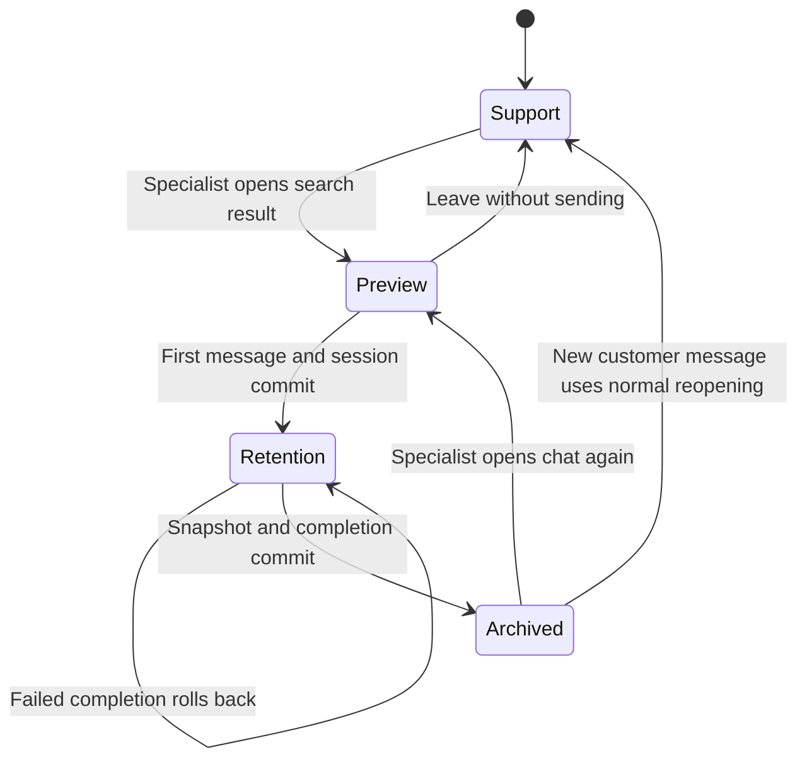

# Retention space: system design

Status: target system design. A working native Telegram workspace is now implemented on this branch. See [implementation status](implementation-status.md) for the exact shipped scope, verification and remaining rollout gates. Proposed mechanisms below are not all implemented.

Date: 2026-09-29. Inspected baselines: Chatwoot `dd88948b2`, chatwoot-extra `701471c`. Both repositories were switched to `main`, pulled with `--ff-only`, and branched to `design/retention-workspace`.

The user confirmed a design and implementation plan first, a shared workspace for selected specialists, and the existing Chatwoot interface conventions. Behavioral choices marked “proposed” below remain reviewable decisions, not claims about implemented behavior.

Related documents:

- [Implementation and verification plan](implementation-plan.md)
- [chatwoot-extra integration contract](../../../chatwoot-extra/docs/retention-space/integration-contract.md) (sibling checkout)
- [Product context](../../PRODUCT.md)

## 1. Decision

Keep the existing Chatwoot conversation, contact, inbox, and Telegram connection. Add an account-scoped retention membership and an independent retention session around that conversation. Chatwoot owns access, session transitions and live message attribution. **chatwoot-extra owns immutable session snapshots and independent attachment copies**, and enforces exclusion from its support workflows. Chatwoot keeps only a snapshot UUID, digest and synchronization timestamp. Future bulk retention AI analysis also belongs to Extra.

The retention session is independent of the support status and team. It must not be represented solely by a label, a custom attribute, a new support status, or assignment to a “retention” support team. Existing code uses those fields for routing, automation, counters, and reporting.

An exact Telegram bot launch `/start rtn` also starts a system-origin session before the launch message or conversation is published to support. Duplicate provider launches are idempotent, including after completion. Ordinary `/start` and other parameters preserve support behavior. The primary specialist action is **find a customer and send the first retention message**. The server atomically starts the session and accepts that message. Browsing, opening a preview, typing, and uploading an unused attachment do not take over the conversation.

“Zero regressions” is the release acceptance target. A design cannot prove that target; the implementation must pass the isolation and ordinary-support comparisons in the verification plan before activation.

## 2. User experience

### Account settings

Add a **Retention specialists** section to Account Settings beside the existing assignment/access sections. An administrator selects existing verified account users in the familiar searchable multiselect and explicitly saves the change. Display selected names, effective inbox access, and a short explanation:

> Selected users can work in Retention and view saved retention sessions for their accessible inboxes.

Membership is account-specific and additive to the user's existing role. It does not change support teams, support assignment eligibility, or grant access to another account. Proposed access rule: retention membership plus existing inbox and enterprise permissions. Show an inline warning for a selected specialist who cannot access any supported inbox, with a link to inbox membership settings. Implement this in a dedicated retention policy: for enterprise roles limited to participation/assignment, evaluate retention ownership/participants after start, not the cleared support assignee. Preview/start still requires the role's existing access to the candidate, and membership alone does not elevate its permissions.

An administrator can configure membership without being a specialist. Per the request that the workspace is visible only to selected users, administrators must also be selected to view its content. Administrative recovery can show counts and reassign responsibility without exposing transcripts.

Removing a member immediately revokes workspace API and snapshot access, including for administrators. Sessions remain intact. Removing the last specialist is allowed while sessions are active; those sessions remain isolated until an administrator assigns an eligible specialist. Successful saves immediately update the sidebar and open workspace, including other browser tabs. Realtime membership events invalidate pending access checks, clear sensitive state, and return a revoked user to normal conversations. Account administrators retain access to the membership settings without implicit workspace access.

### Navigation and layout

Place **Retention** immediately above **Dialogues** in the existing sidebar, visible only when the server reports `retention_access: true`. Keep its unread badge separate from support counters.

Inside Retention, use three tabs: **Active**, **Find chat**, **History**. Keep the existing split layout: list on the left, transcript and composer in the center, collapsible customer details on the right. On a narrow screen show one pane at a time with Back preserving tab, query, and scroll position.

```text
Sidebar               Retention
                      [ Active ] [ Find chat ] [ History ]
Retention   3         Search name, @username, or Telegram ID
Dialogues             -------------------------------------------
                      Customer / source    Customer name   @handle
                      Last message         Retention · Maya
                      Specialist           [Complete retention]
                                           -----------------------
                                           Existing chat history
                                           Retention started 14:08
                                           Messages...
                                           -----------------------
                                           Type a message...
                                           [Attach]         [Send]
```

Reuse the existing font, spacing, Tailwind tokens, light/dark preference, focus treatment, and message bubbles from `components-next/`. Color strategy: restrained, with existing selected and semantic states. Physical context: specialists handling many customer chats during a shift need the same legible workstation interface as support; preserve their current theme. Anchors are this installation's Account Settings, conversation split view, and archived conversation view. No new decorative visual direction is needed. Fidelity for this deliverable is a flow specification and structural wireframe.

### Find and preview

Search by customer/chat name, Telegram username, or Telegram numeric ID. Normalize leading `@` and recognized `t.me/<username>` input; compare usernames without case sensitivity. Read both `social_telegram_user_name` and legacy `username`, and identify numeric Telegram IDs through `social_telegram_user_id` / contact-inbox `source_id`. Keep Telegram IDs as decimal strings at API boundaries. Account and inbox identify the channel; a name or username is never a unique key.

Results show name, username, source/inbox, current status, last activity, and active retention specialist if present. Rank exact Telegram identities before name matches. Page results on the server and debounce typing. Search resolves existing Chatwoot conversations only in v1; it does not create a contact or an external Telegram chat from an arbitrary handle. Default channel scope is existing `Channel::Telegram` conversations, including their currently supported business transport. Other channels require their own isolation review.

V1 search/start must resolve the same canonical conversation as Telegram ingress for each contact-inbox. The inspected incoming service uses `contact_inbox.conversations.first`, whereas `ContactInbox#current_conversation` uses `.last`. Do not reuse the latter blindly or offer arbitrary duplicate historical conversations as takeover candidates. Extract the current ingress rule into a shared resolver, lock the contact-inbox before start, and enforce one active retention session per contact-inbox as well as per conversation. If several Chatwoot records represent the same physical chat, explain the canonical target in search without merging or rewriting their history. Apply active-retention exclusion and delivery admission to all aliases for that physical identity so an older conversation record cannot bypass the workspace. Include aliases when invalidating cached lists and search results.

Opening a result is a read-only preview with a draft composer. It does not change support read markers, assignment, presence, status, or automation timers. The first button says **Send and start retention**. Helper copy explains that sending moves the conversation into Retention until completion.

Proposed takeover behavior: archived and active support conversations are both eligible. For an active support conversation, show its status/assignee and require an inline **Move this conversation to Retention** acknowledgment before the first send. Bind that acknowledgment to the displayed conversation revision. If support changes it before sending, refresh the preview and retain the draft. This avoids silently interrupting a newly assigned support operator while still supporting the requested takeover.

If another specialist starts first, return a conflict, preserve the draft, and open the existing session. Never silently send the loser's first message into somebody else's session.

### Active session

Every eligible retention member can see the shared list and transcript. Record a responsible specialist separately from Chatwoot's support assignee. Proposed write behavior: the responsible specialist sends, edits their allowed messages, and completes; another specialist uses an explicit **Take over** action to change responsibility atomically. Show responsibility and typing state so two specialists do not independently reply to the same customer.

Keep familiar text, attachments, reply-to, delivery feedback, retry, and supported message editing. Reuse presentation/editor primitives through an explicit retention capability set; do not mount the whole support conversation container and inherit its tracking hooks. Plain chat excludes macros with side effects, tasks, support resolution reasons/topics, AI suggestions/classification, automatic translation/transcription, routing controls, CSAT, farewell messages, and support presence/response tracking. Account-wide login/availability behavior is unchanged; retention-specific work is not added to support conversation KPIs.

Incoming replies stay in the active retention session. Native notifications are addressed only to currently selected, inbox-authorized specialists; links open the active workspace or completed snapshot. Dedicated session read markers and typing/presence remain future extensions. The support frontend must remove a newly captured conversation, clear its selected transcript and draft from view, stop support presence, and refetch counters. A stale support send is rejected by the server.

The customer sees the same Telegram chat and normal replies. Voice messages must be retained as attachments in Retention, bypassing the current automatic voice-forward/transcription path. Existing channel restrictions still apply; isolation must not disable transport, status updates, attachment downloads, or customer delivery.

### Complete and history

**Complete retention** opens an inline confirmation area with an optional outcome and note. These belong to the retention session, never to support resolution fields. Copy: “Save this session and move the conversation to Archive.” Warn about an unsent draft. Disable completion while delivery attempts are pending or uncertain; failed messages can be explicitly abandoned and preserved with their failure status.

The success response means the full snapshot is durable and the conversation is archived. If either step fails, the session remains active and the draft/transcript remains available. A duplicate completion returns the original snapshot.

History shows one row per completed session: customer and Telegram identity as saved, source, specialist, start/completion times, optional outcome, and session message count. Filters: name/Telegram, specialist, date range, and inbox. Opening a row shows a read-only transcript with clear **Saved on …** and **Retention started here** markers. Show only the captured retention session messages. No live conversation reads are used to reconstruct a snapshot.

**Start another retention session** opens the current live conversation preview. Only a new first send creates a new session and a new eventual snapshot. Previous snapshots never change.

Proposed archive visibility: after completion, normal users with existing permissions can read the live archived conversation, including its public retention messages. The saved snapshot collection and retention outcome notes remain restricted. Retention message attribution remains permanent, so future support analytics and AI context still exclude those messages.

### State and interaction requirements

| State | Required behavior |
| --- | --- |
| No members / feature not launched | No workspace entry; admin sees configuration and launch state. |
| Empty Active | “No active retention chats. Find a chat to start.” |
| Empty History | “Completed sessions will appear here.” |
| Search loading / no results | Preserve query; row skeletons; name, username, and source guidance. |
| Sending / provider failure | Preserve draft or failed bubble; reuse the same accepted message for retry. |
| Another specialist acts first | Explain who is responsible; preserve draft; offer explicit takeover. |
| Completion saving / failure | Disable duplicate action; remain in session on failure; show retry. |
| Access revoked | Clear sensitive state; stop subscriptions; route to permitted area. |
| Reconnect / stale tab | Reload capabilities and session revision before enabling writes. |
| Snapshot attachment missing before capture | Show an explicit historical unavailability marker. |

Use semantic tab navigation, visible labels and focus, announced save/send/error states, and no color-only status. Keep all new copy in matching English and Russian keys. Suggested labels: “Retention” / “Удержание”, “Find chat” / “Найти чат”, “History” / “История”, “Complete retention” / “Завершить удержание”.

## 3. Authority and invariants

Chatwoot PostgreSQL is the authority for live ownership, membership and message attribution. Extra PostgreSQL and its private file store are the authority for completed snapshot payloads. Extra cannot grant browser access or override Chatwoot's current membership/workflow state.

1. At most one unfinished session per `(account_id, conversation_id)`.
2. Start, the first accepted outgoing message, and its delivery intent commit together.
3. Every message records its workflow at ingestion. Retention attribution never changes when a session closes.
4. Active retention conversations are absent from ordinary support lists, counts, search results, direct reads, exports, realtime payloads, and writes, for specialists too. They are available through the retention interface only.
5. Support automation and tracking consume only eligible support-origin activity. Retention completion cannot look like a support resolution.
6. Allowed customer transport and retention realtime continue throughout a session.
7. Extra durably prepares the snapshot before Chatwoot commits completion/archive. Only a committed Chatwoot receipt can publish that capture in Extra History; failed transactions leave private prepared captures.
8. All authorization keys include the account. Account-local display IDs are never used as global identifiers.
9. Disabling new starts does not disable isolation or strand active sessions.
10. Browsing history and previewing a chat produce no support workflow side effects.



Preview is browser state, not a server workflow mode. While retained, keep the conversation in an existing `open` transport status but give the retention session priority over all support status interpretation. The retention owner is stored on the session; support `team_id`, `assignee_id`, and `assignee_agent_bot_id` are cleared on entry after their prior values are recorded. On completion, use existing `resolved` for archive. Normal post-retention inbound traffic starts a fresh support cycle.

## 4. Data model

Proposed extensions follow the implemented core. The authorized legacy snapshot removal is irreversible. Do not use a global default scope to hide retained conversations.

| Object | New data and purpose |
| --- | --- |
| `account_users` | `retention_member` boolean default false; existing account-user uniqueness anchors membership. |
| Account configuration | New-start feature gate and membership revision; expose current user's retention capabilities. |
| `conversations` | Nullable `active_retention_session_id`; `workflow_epoch` bigint default 0; nullable `retention_archived_at`; nullable `support_cycle_started_at` for conversations resuming after retention. |
| `retention_sessions` (Chatwoot) | Rails integer ID, Extra snapshot UUID/digest/sync timestamp, entry source/parameter, account/internal conversation/inbox IDs, display ID as reference, starter/owner/completer IDs and saved names, start/end times, sequence number, prior support state, optional outcome/note, `lock_version`. `completed_at IS NULL` defines unfinished. |
| `messages` | Nullable immutable `retention_session_id`; `workflow_epoch` captured on create. Both default to legacy support interpretation for existing rows. |
| `retention_snapshots` (Extra) | UUID, source/account/session/inbox IDs, format version, actors/times, immutable session JSON text, digest, summary/counts, prepared/committed state. |
| Snapshot messages (inside Extra payload) | Original IDs, saved sender/content/state/attributes, session attribution; deterministic `(created_at, id)` order independent of live rows. |
| `retention_files` / `retention_snapshot_files` (Extra) | Legacy version 2 private copied bytes and references; new version 3 snapshots use original Chatwoot attachment/blob metadata and create no Extra file rows. |
| `retention_session_reads` | Session/account-user, last read ordinal or message position. Separate from support seen fields. |
| Workflow outbox | UUID event ID, account/internal conversation/display IDs, workflow epoch, immutable scope/session/reason, sequence, payload, publish state. Written with transition/message mutations. |
| Request/delivery operations | Scoped idempotency key, body digest, accepted resource/result, pending/sent/failed/uncertain state. Prevent duplicate first sends/completions and support safe transport barriers. |

Store `contact_inbox_id` on the session and use partial unique indexes on `(account_id, conversation_id)` and `(account_id, contact_inbox_id) WHERE completed_at IS NULL`, unique `(conversation_id, sequence)`, unique committed Extra `(source_id, account_id, source_session_id)`, and immutable `(source_id, account_id, source_session_id, digest)` capture versions. Add account/inbox/history timestamp indexes, session/message pagination indexes, and pending outbox indexes. Foreign keys and checks must ensure session, conversation, message, and snapshot accounts agree; validate the active pointer refers to the same conversation's unfinished session. Use composite keys or a deferred consistency trigger where an ordinary FK is insufficient.

Do not cascade ordinary conversation/contact/message deletion into saved snapshots. Save identity labels as values; deleting an operator must not erase attribution. Treat source IDs as provenance, not mandatory references to live rows. Account erasure is an explicit purge path encompassing snapshots and attachments. Immutability applies during ordinary operation, with explicit audited administrative erasure outside this workflow.

## 5. Transitions, concurrency, and delivery

### Common serialization rule

For an enabled account, all conversation-affecting writes acquire the same conversation lock and reload current workflow before acting: incoming message creation, outgoing acceptance, edits/deletes, assignment/status/bulk writes, session start/end, and callback mutations. Lock ordering is contact-inbox (where needed) then conversation then session, consistently with Telegram ingestion. Never trust an earlier controller authorization check after waiting for a lock.

Each transition increments `workflow_epoch`. Every queued support side effect carries its originating epoch. It can run only while the authoritative workflow is support and its epoch still matches. A job from before retention must not wake up after completion and close or message the now-normal conversation.

Historical facts use their original event scope rather than current mode. A legitimate pre-retention support message or completed response statistic arriving late must still be stored through ordered historical ingestion, without scheduling a live effect or modifying current counters. Extra's contract defines the durable event inbox and epoch-specific tracking needed to preserve those facts. An interrupted, unanswered support interval is never fabricated into a retention response or resolution.

Message creation, tagging, and transition events must precede callbacks. Capture scope/epoch/transition reason as scalar data in the durable event envelope inside the transaction. `Current` or a Ruby virtual attribute is insufficient across Sidekiq jobs. A GlobalID reload can show a different workflow later.

### Start on the first send

1. Authorize account membership, inbox access, channel eligibility, and rollout readiness. Validate content/attachments and a scoped idempotency key/body digest.
2. Acquire the conversation lock and check the expected revision, active-session uniqueness, any takeover acknowledgment, and outstanding transport operations. Wait/retry if an already accepted support delivery is in flight; do not claim activation while that delivery can still arrive.
3. Create the session, record prior support state, increment the epoch, set the active pointer, and clear active support assignment/waiting/first-reply/resolution workflow fields. Cancel support SLA/timer intent for this conversation without recording a support resolution. Preserve existing completed support records and unfinished tasks as historical work; task writes cannot run against the retained conversation.
4. Create the first normal transport message with immutable session attribution and a durable delivery intent. Record `retention.started` plus content-free support-list invalidation in the same transaction.
5. Commit. Only then allow provider dispatch. Return the session and accepted message. Validation failure rolls everything back; a provider failure after acceptance leaves an active session and a visible failed/uncertain message.

Two racing starts serialize; the second gets the original result for the same key, or `409 retention_already_active` for a different request. A network timeout is retried with the same key. Do not infer message acceptance from whether the browser received a response.

### Complete

1. Acquire the conversation and membership locks. Recheck membership, inbox access, the active session and pending deliveries. Build the exact session-only transcript under the ingress lock, including original media references and metadata.
2. Send canonical UTF-8 JSON and its digest to Extra's signed prepare endpoint. Extra persists an immutable metadata-only capture and validates each referenced attachment's identity. If preparation fails, keep the session active.
3. Save the receipt and completing actor/time, archive the live conversation, clear support assignment/timing fields and increment the epoch in one Chatwoot transaction. Support resolution callbacks are bypassed.
4. After commit, acknowledge Extra. Only committed captures appear in History. A lost acknowledgment is recovered by a retrying Chatwoot job and Extra's periodic signed receipt reconciliation. A rolled-back Chatwoot attempt stays a private prepared capture. One committed capture per source/account/session is enforced by a partial unique index.

The precise transcript boundary is the Chatwoot ingress lock. Incoming messages committed before completion belong to the captured session; later ones resume support. Provider timestamps do not determine membership. Later live edits/status changes never rewrite Extra's archived JSON. The 50 MB transcript JSON limit fails an oversized capture without releasing the chat. Media bytes remain in Chatwoot ActiveStorage; a later deletion makes the original file unavailable while saved metadata remains. Extra's private file volume is required only for older version 2 copied-file snapshots. See [snapshot storage and future analysis](../../../chatwoot-extra/docs/retention-space/snapshot-storage.md).

### Resume ordinary support

The next non-retention customer message follows the current Telegram reopen path, reinstates normal support routing, and initializes a fresh support cycle/response baseline. Exclude all `retention_session_id != null` messages from support reply metrics, agent quality analysis, search ingestion used by those workflows, and AI context. Filter nested context arrays too. Preserve support records that existed before retention; do not delete or replay them as a “reset.”

Current reporting uses conversation creation time in some duration calculations. For conversations that return from retention, use the explicit new support-cycle baseline so retention time cannot inflate later resolution or response durations. Preserve the legacy formula when `support_cycle_started_at` is null. This is a required targeted change with before/after fixtures, not a global reporting rewrite.

Archive sorting currently depends on `ReportingEvent(name=conversation_resolved)`. Use the later of the existing support resolution time and `retention_archived_at`, with current fallbacks, for archive order. Do not synthesize a reporting event just to move the conversation to the top.

### External send boundary

Checking a cached retention flag immediately before a Telegram request leaves a race between the check and the request. Controlled senders must share a durable admission/transport barrier with session start and completion. For retention-enabled inboxes, route direct automated deliveries through a Chatwoot-owned delivery gateway that registers the operation and epoch under the conversation lock, then performs provider I/O outside the lock. Start cannot commit while an admitted support operation is pending/in flight/uncertain. Recovery reconciles or explicitly cancels those operations; an elapsed lease alone must not declare an uncertain send safe.

Normal retention messages retain the existing channel adapter. No new Telegram bot or duplicate customer conversation is created. Provider acceptance may be uncertain after a timeout; an outbox guarantees durable dispatch intent, not exactly-once Telegram delivery. Show uncertainty and avoid blind replay. Account-specific enablement requires this boundary for every controlled sender addressing the same Telegram identity, including ads, callbacks and media/edit/delete paths.

The separate Telegram Dialogues integration talks to an external messaging service. If it addresses the same physical chat, mapped reads and sends must enforce retention access and delivery admission as well. Any worker in that external service that can send autonomously needs the same contract. This design does not assert control over external Telegram clients or uninspected services; inventory and verify them before enabling the affected inbox. Keep unmapped chats outside retention eligibility until an authoritative account/inbox/Telegram identity mapping exists.

## 6. Isolation boundaries in the current repositories

| Boundary | Inspected integration point and required change |
| --- | --- |
| Settings/access | `app/models/account_user.rb`, `app/controllers/api/v1/accounts_controller.rb`, `app/policies/account_policy.rb`; add dedicated member update/capability endpoints with atomic validation. |
| Conversation policy | `app/policies/conversation_policy.rb` currently grants admin/bot/inbox/team access. Apply workflow restrictions before those shortcuts. Add dedicated retention policy; cover the enterprise overlay. |
| Lists/counters | `app/finders/conversation_finder.rb`, `app/services/conversations/permission_filter_service.rb`, filter service, live reports; exclude active retention before counts and all branch-specific relation replacements, including participating and resolved paths. |
| Direct/contact/search access | Conversation/base/messages controllers, contacts/conversations controller, `app/services/search_service.rb`, enterprise advanced search, notification links, attachments/transcripts/exports. Account-scoped authorization at every entry point. |
| Realtime | `app/listeners/action_cable_listener.rb` and `app/jobs/action_cable_broadcast_job.rb`. Recompute allowed recipients at delivery; do not reuse old member lists or let a support job reserialize a now-retained transcript. Send only IDs/revision in support invalidation. |
| Message lifecycle | `app/models/message.rb`: separate transport/activity from support reopen, first reply/waiting, template hooks, search indexing, and context event processing. Preserve send/edit/delete adapters. |
| Conversation lifecycle | `app/models/conversation.rb`: support-247 assignment, AML opening, status activities, after-commit events; guard entry/exit with persisted operation scope. |
| Bulk writes | `backfill_support_247_team` in accounts controller uses `update_all`, bypassing callbacks. Guard bulk assignment/status, merge/delete, and scheduler paths explicitly. |
| Rails listeners/jobs | Sync and async dispatchers, automation rules, bots, CSAT, campaign/hooks, notifications, participation, reporting, auto-resolution/reopen, enterprise Captain and SLA. Persist event scope and recheck current epoch before effects. |
| Extra webhooks | `src/modules/webhooks/webhook-dispatcher.ts` gates before every subscriber. Priority is insufficient because dispatch defaults to parallel. Update DTOs and event identity. |
| Extra tracking | Conversation-message storage, response/resolution statistics, operator notifications/presence, player overlay, quality review and MeiliSearch must not ingest retention activity. |
| Extra automation | Bot flow/AI topic classification, AML routing, CSAT/callbacks, resolution farewell, delayed inactivity/break queues and scheduled/direct ads require execution-time guards. |
| Context/reimport | `app/services/messages/context_fetcher_service.rb`, recent/all-message APIs used by Extra, `src/modules/conversation-export/`, `scripts/import-conversation-messages.ts`; explicit support-only projection, with nested context filtering and origin-aware reimport. |
| Telegram ingress | `app/services/telegram/incoming_message_service.rb`: conversation locking, callbacks with synthetic message ID 0, and voice-forward shortcut all need classification. |
| Frontend hooks | Sidebar, normal conversation store/event handlers, `ConversationView.vue`, `ReplyBox.vue`, `useOperatorPresence.js`; separate retention store/capabilities and avoid support side effects. |

Use explicit `support_visible` query scopes at request boundaries, and a shared execution policy at mutation/delivery boundaries. Recheck permission on snapshot/media downloads and delayed realtime jobs. Search index deletion/update alone is eventually consistent: authorize results against authoritative workflow before returning content or counts. Old indexed support messages must also be hidden while their conversation is retained.

Outdated signed blob links may remain usable until expiry if storage serves them publicly. New retention media must use authenticated proxy/download routes with short-lived object redirects; assess existing-link lifetime during rollout. Removing an entry from the UI cannot retract data already delivered to a browser.

## 7. Public API shape

All browser endpoints live under authenticated Chatwoot `/api/v1/accounts/:account_id/retention`. They derive the actor from the session/token, never `user_id` in a body or the browser-visible Extra API key. Public conversation references use `conversation_display_id`; internal FKs use `conversation_id`. Current sessions use Rails integer IDs; Extra snapshots and legacy copied files use UUIDs.

| Method/path | Purpose |
| --- | --- |
| `GET /capabilities` | Membership, start availability, accessible supported inboxes. |
| `GET /members`, `PUT /members` | Admin-only membership with expected revision; last-member revocation is allowed and preserves active sessions. |
| `GET /conversations?q=…&cursor=…` | Search permitted existing conversations. |
| `GET /conversations/:display_id/preview` | Read-only preview plus current revision and takeover requirements. |
| `POST /sessions` | Conversation display ID, first message/attachments, expected workflow revision, takeover acknowledgment; idempotency required. |
| `GET /sessions?state=active&cursor=…` | Shared permitted active list. |
| `GET /sessions/:id`, `GET /sessions/:id/messages` | Live retention detail and cursor-paged transcript. |
| `POST /sessions/:id/messages` | Accept attributed outgoing message with idempotency key and expected session revision. |
| `POST /sessions/:id/takeover` | Atomic responsibility change with expected revision. |
| `PUT /sessions/:id/read` | Retention read marker only. |
| `POST /sessions/:id/complete` | Outcome/note and expected revision; returns existing or newly committed snapshot. |
| `GET /snapshots`, `GET /snapshots/:id`, `GET /snapshots/:id/messages` | Immutable history with filters and cursor pagination. |
| `GET /snapshots/:id/export`, attachment download | Authorized machine-readable export / retained media; never public by knowledge of UUID. |

Dedicated retention message edit/delete/retry/upload routes use the same policy and operation locks. Restrict manual edits to allowed messages from the current session; history and prior support messages are read-only in this space. Ordinary support mutation APIs reject retained conversations even for specialists; customer ingress and trusted provider status callbacks use separately authenticated transport paths.

Use `401` unauthenticated, `403` missing workspace membership, `404` inaccessible account/inbox/resource, `409` revision/ownership/delivery conflict, `422` validation, and a retriable service error when authoritative workflow cannot be determined. Stable machine codes accompany localized UI messages. The same idempotency key with a different body is a conflict; successful keys return their recorded result after reconnect.

## 8. Snapshot contract and future AI

A snapshot contains all messages attributed to exactly one retention session, including specialist messages, customer replies and their attachments. Select by immutable `retention_session_id`, from the first accepted retention message through completion. Exclude earlier support history, other retention sessions and later support messages. Include any private/activity/deleted state only for messages belonging to the captured session. Capture full stored content and file references; do not truncate to the webhook context or infer membership from timestamps. Data deleted before capture is explicitly unavailable.

The snapshot manifest freezes the contact/channel/session metadata, participants and their saved names/roles, UTC timestamps, channel identity, snapshot schema version and content digest. Message rows include original ID/source ID, normalized role, sender identity at capture, direction, private/activity/deleted flags, content/content type, relevant content attributes, reply linkage, provider delivery state, timestamps, workflow origin/session ID, and attachment references. Assign stable snapshot ordinals using the chosen transcript order `(created_at, id)`; session membership comes from attribution, not timestamp or ID range. Serialize an allowlist; do not copy authentication tokens, bot credentials, signed URLs, or arbitrary integration secrets.

Current snapshot shape (simplified; exact canonical JSON contains full message attributes):

```json
{
  "schema_version": 3,
  "transcript_scope": "retention_session",
  "attachment_storage": "chatwoot",
  "session_id": 42,
  "account_id": 7,
  "conversation": { "display_id": 326 },
  "inbox": { "id": 12, "name": "Telegram" },
  "contact": { "name": "Example customer" },
  "started_by": { "id": 9, "name": "Specialist" },
  "completed_by": { "id": 9, "name": "Specialist" },
  "started_at": "2026-09-29T12:08:00Z",
  "completed_at": "2026-09-29T12:32:00Z",
  "messages": [
    {
      "id": 101,
      "retention_session_id": 42,
      "content": "Example",
      "attachments": [
        {
          "id": 55,
          "message_id": 101,
          "account_id": 7,
          "blob_id": 68,
          "storage": "chatwoot_active_storage",
          "filename": "example.jpg",
          "content_type": "image/jpeg",
          "byte_size": 2048,
          "checksum_algorithm": "md5_base64",
          "checksum": "<original ActiveStorage checksum>"
        }
      ]
    }
  ]
}
```

Every captured message has this snapshot's session ID. There are no historical-context messages in a snapshot, so future analysis receives only the retention conversation being evaluated. The live preview may still show earlier history to the specialist. Store any future analysis separately keyed by snapshot ID, digest, analysis/prompt version, and model version. Re-analysis creates a new result and never alters the source snapshot. Future analysis jobs are triggered only by an explicit retention analysis workflow; current support AI consumers cannot subscribe to transcript-bearing retention events.

Use a deterministic canonicalization spec for hashing with fixed field names, ordering, encoding, timestamp precision, and attachment checksums. The database transcript is available when completion succeeds; original media depends on Chatwoot file retention. Prefer JSON/NDJSON for analysis and paginated JSON for the UI. CSV may be an optional human export, never the archival source of truth.

## 9. Rollout and decisions to review

Roll out additively with starts disabled, then enable one account/inbox cohort after all producer/consumer versions, execution guards, senders, authorization paths, queues, and rollback behavior have passed the implementation plan. Isolation for existing active sessions and message attribution must not depend on the launch flag. Disable starts first during an incident; finish existing sessions safely before any rollback that lacks retention awareness.

Review these proposed product defaults before implementation:

1. Retention membership intersects existing inbox and enterprise access; an admin must also be selected to read the workspace.
2. All specialists see eligible active sessions, while one responsible specialist controls writes with explicit takeover.
3. Active support conversations may be taken over after an inline acknowledgment; preview/drafting never moves them.
4. Live public retention messages are visible in normal archive after completion; snapshots/outcome notes remain restricted and support tracking excludes retention messages permanently.
5. Confirmed snapshot scope: only the captured retention session and its attachments. Each later session has an independent snapshot. V1 targets existing Telegram conversations.

No unresolved design choice above prevents preparing the implementation plan. External sender inventory, longest-history measurements, existing attachment purge policy, and production queue/version topology are implementation discovery gates; they have not been verified against production in this design-only work.
