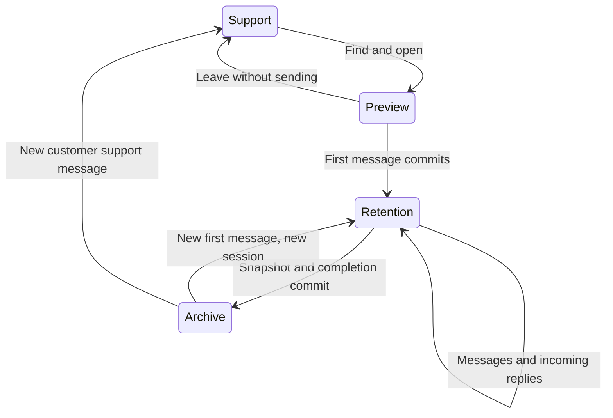

# Retention workspace: implementation status

Date: 2026-09-30. Both repositories: `design/retention-workspace`.

This document describes the running branch. The [design](design.md) and [plan](implementation-plan.md) also describe future production hardening; they are not evidence that every proposed mechanism exists.

## Using the workspace

1. An administrator selects confirmed account users in **Settings → Account settings → Retention specialists** and clicks **Save specialists**.
2. Selected users see **Retention space / Удержание** immediately above **Conversations / Диалоги**. Membership refreshes through realtime notifications, on focus and periodically. The workspace list and open chat follow content-free realtime events; reconnect/focus and a quiet periodic check recover missed events. There is no workspace Refresh button.
3. **Search** finds native Chatwoot Telegram conversations by contact name, Telegram username/ID or conversation number. The specialist must also belong to the inbox. Explicit retention membership grants access to the shared workspace independently of support assignee/team restrictions. Administrators must select themselves if they need retention access.
4. Opening a result is a read-only preview. **Start & send** atomically starts a session and accepts the first message or file. Subsequent sends use that session. Text, multiple files with an optional caption, incoming media, private-note/history rendering, delivery status and failed-delivery retry are available. Specialists can edit or delete their space's delivered outgoing messages, including file captions, during an active session. Failed sends can be edited or deleted locally before retry. Telegram must accept a delivered-message change before Chatwoot applies it. Retention file delivery uploads original bytes through Telegram's media API, so it does not require an externally reachable Chatwoot file URL.
5. The active conversation disappears from the normal Chatwoot lists, search and conversation APIs, including for administrators who are not accessing it through retention. Retention participants work in the shared space.
6. **Complete & archive** waits for pending deliveries, durably stores only that retention session's messages and media metadata in chatwoot-extra, then returns the live conversation to the normal resolved/archive state. It opens the saved snapshot in **History**. A later session creates a separate snapshot. If publication acknowledgment is delayed, a saved/syncing status appears and History opens it after recovery.

The live preview loads 100 messages at a time; snapshots contain only messages whose `retention_session_id` matches the captured session, including specialist messages, customer replies and their attachments. Earlier support history, other retention sessions and subsequent support messages are excluded, even if timestamps overlap. History is scoped to the account, selected membership and current inbox access. Completed snapshots cannot be edited through the application. Conversation deletion is restricted while retention history exists.

## State and concurrency

Ownership of the implemented records:

| Record | Purpose |
| --- | --- |
| `account_users.retention_member` | Account membership with default false; revision-checked admin updates. |
| `retention_sessions` (Chatwoot) | Start/completion actors and dates, entry source/parameter; Extra snapshot UUID, SHA-256 digest and sync timestamp. One active session per conversation is enforced by a partial unique index. |
| Conversation active pointer and `workflow_epoch` | Atomic ownership and generation for rejecting stale support work. |
| Message session, epoch and request UUID | Permanent origin and idempotent first/subsequent sends. |
| `support_delivery_leases` | Two-minute renewable admission for Extra support work and direct Telegram advertising operations. |

Start, send, edit, delete and completion lock the conversation. Membership is rechecked at mutation time. Message edits and deletions compare against the text shown when the specialist began the action, so another specialist's edit cannot be silently overwritten. Stale browser sessions receive a conflict, and failed creation/snapshot transactions preserve the previous state. Existing support delivery leases prevent takeover until that work ends. Provider sends hold the same conversation lock. A completed session's failed or delayed message cannot subsequently be delivered by a stale job.

New Extra snapshots have `schema_version: 3`, `transcript_scope: 'retention_session'`, copied contact/inbox/sender data, session timing and actors, complete message attributes, session attribution, and original Chatwoot attachment/blob metadata and checksums. Edit/delete revisions retain the previous text, actor and timestamp; deletion also retains removed attachment metadata while removing the original attachment from Chatwoot and showing a tombstone. Media bytes stay in Chatwoot ActiveStorage while their attachments exist; existing version 2 copied-file snapshots remain readable. Extra persists exact canonical JSON bytes as text and indexed immutable summary metadata separately; database constraints enforce one committed capture per session and a trigger rejects rewrites. The digest uses recursively sorted JSON object keys after JSON normalization, preserving array order. Verify it against the exact `payload_json` text stored in Extra; attachment download URLs added to API responses are temporary presentation fields and excluded from the digest. No AI analysis is triggered.

## Existing support integrations

| Boundary | Implemented protection |
| --- | --- |
| Rails message/conversation callbacks | Retention messages bypass support reopening, assignment, activity, bot/template and reporting callbacks. Normal support mutations reject active/stale workflows. |
| Event dispatch, webhook jobs and realtime jobs | Reject retention messages and stale support generations; lifecycle broadcasts contain metadata only. |
| Search, conversation lists and direct endpoints | Active conversations excluded; support search excludes retention-origin messages permanently. |
| Reports, webhook/AI context and Extra exports | Support message counts and context exclude retained messages; a new support cycle gets a fresh timing baseline. Extra requests `support_only=true` for exports. |
| Extra webhook subscribers | Admission before any support subscriber runs. Retention-origin and stale-generation events are suppressed. Unavailable authority fails closed. |
| Delayed break/inactivity jobs | Carry their original generation; stale jobs cannot be revived after completion. |
| Telegram voice | Active retention receives raw voice media; existing support transcription jobs are generation-checked. |
| Ads send, test send and delete | Admission by account, inbox and Telegram recipient at execution time. Only successfully deleted ads are marked deleted. |
| Extra lifecycle cleanup | Clear pending support timers, topic/AI caches and notifications once per newer account/conversation generation. The next legitimate support event also performs missed cleanup. |

The existing archive can display the live transcript after completion. Support-only context/export projections continue to omit retention messages. An old pre-retention event that has not yet been processed is suppressed after its generation ends; durable historical replay of those support facts is not implemented.

## Deployment

Apply `bin/rails db:migrate` with these migrations:

- `20260929120000_add_retention_member_to_account_users`
- `20260929130000_create_retention_sessions`
- `20260929131000_create_support_delivery_leases`
- `20260929132000_scope_retention_snapshots_to_their_sessions` (legacy session scope correction)
- `20260930130000_move_retention_snapshot_storage_to_extra` (drops the authorized legacy JSONB snapshots and pins; preserves live messages/files)
- `20260930140000_support_telegram_retention_entry` (system-origin starting actor and entry metadata)

Upgrade Chatwoot's web/worker/frontend and all Extra processes together before starting retention sessions. Extra now requires the Rails workflow/lease endpoints for existing support processing. Old Extra workers must not remain running: they do not honor retention. Ad test/delete requests now include the same encrypted Chatwoot account credential and API URL as ordinary ad sending; the matching frontend supplies them.

Run `bun run db:migrate` in Extra for `0062_retention_snapshots` and `0063_retention_telegram_entry`. Configure the same dedicated server-only `CHATWOOT_RETENTION_SECRET` and stable `RETENTION_SOURCE_ID` in both repositories. Chatwoot uses `CHATWOOT_EXTRA_API_URL`; Extra uses `CHATWOOT_URL` for signed receipt recovery. The private Extra `storage/retention` volume remains necessary for existing version 2 snapshots; version 3 stores no new file copies. Back up Extra PostgreSQL and any legacy media volume. Details and future bulk AI architecture: [snapshot storage](../../../chatwoot-extra/docs/retention-space/snapshot-storage.md).

Both local development databases have the new migrations applied, and both web/worker stacks were restarted. The old snapshots were discarded as requested. Do not roll back only one repository with active retention sessions. Membership revocation is allowed even for the last specialist with active sessions. Those sessions remain isolated until an administrator adds an eligible specialist; removal does not complete or release them. Saved membership lists immediately update the sidebar, clear revoked workspace state and redirect to normal conversations. BroadcastChannel updates other local browser tabs; targeted realtime metadata handles changes saved by another administrator. Capabilities checks also refresh on focus, reconnect and every 30 seconds, and API authorization always uses current database membership.

## Telegram launch and notifications

`https://t.me/<bot_username>?start=rtn` delivers an exact private `/start rtn` message ([Telegram documentation](https://core.telegram.org/bots/features#deep-linking)). Ingestion creates or takes over the canonical chat inside the same transaction before conversation/message callbacks can publish support events. The launch is a session message; subsequent replies stay in retention. The starting actor is explicitly system-origin, with no invented specialist account. Duplicate launch updates do not create another session, including after completion. A new provider launch after completion starts a new independent session. An empty specialist list still isolates the chat. Existing live delivery leases cause a retry instead of admitting the launch into support. Ordinary `/start` and other parameters keep existing support behavior.

Customer messages create native Chatwoot notifications only for currently selected specialists who can access that Telegram inbox. They use the existing participating-conversation notification type and its push/email preferences; the UI labels these alerts Retention. The notification bell, read/snooze/delete actions, selected audio tone/visibility settings and browser push transport are reused. Specialist sends do not notify other specialists. Fresh links point to the retention chat, or its snapshot once completed. Notification reads and queued realtime/push/email delivery check current access. Membership removal deletes retention alerts and refreshes their counts; inbox removal filters remaining records. Reading a visible retention chat marks its alert read. No support presence or response tracking is invoked.

The retention sidebar badge and Active tab count unread **active conversations** for the current specialist. Active/Search rows display an Unread label. The authoritative `capabilities.unread_conversation_ids` query spans all notifications, regardless of notification/list pagination, and excludes read/snoozed alerts, completed/prior sessions and inaccessible inboxes. Counters refresh on realtime notification/lifecycle events, local notification actions, focus/reconnect and the existing 30-second access poll; revocation clears them immediately. `POST conversations/:id/read` checks current membership/inbox access and active session under the conversation lock, and marks only this user's session alerts through the last displayed message ID. Newer arrivals and support alerts remain unread. This operation does not update support conversation tracking.

## Verification

Current architecture checks (2026-09-30):

- Rails: 67 focused workspace, notification and Telegram entry examples pass, including Telegram edit/delete acceptance and rejection, file caption editing, failed-send edits, membership revocation and completed-session immutability. Two opt-in integration examples also pass against a real isolated Extra service and PostgreSQL database, including edit/delete revision history. The existing normal-conversation message controller selection passes (22 examples).
- Extra: 12 isolated database/storage/workflow tests pass, including immutable version 3 metadata-only captures with no new copied-file rows, rejection of embedded file bytes or cross-account references, signed request tampering, reconciliation and version 2 copied-file readability.
- Vue: 50 retention workspace, access, settings and native notification tests pass. A subsequent 12-test workspace/message check passes with the edit/delete concurrency guard, controls, tombstones, file draft/retry behavior and the realtime refresh event.
- Live Chromium: the received image renders from a same-origin signed link, a document is visible, byte-range download works, multiple files can be drafted without text, and completion is disabled while a draft remains. Removing specialist membership hides the space and revokes the issued media URL. Zero page JavaScript errors. The Refresh button is absent.
- Earlier broader support/notification regression selection: 115 examples, 112 pass; the same three Telegram baseline failures reproduce on clean `main` (`dd88948b2`). Other existing notification, Enterprise mailer and support workflow checks pass. The existing native Telegram media-group spec has stale expectations against its unchanged sender; the new retention sender is isolated from that code path.
- Targeted Ruby/JS/Extra lint and `git diff --check` pass. The full repository TypeScript check retains previously identified unrelated diagnostics; the retention storage module adds none.
